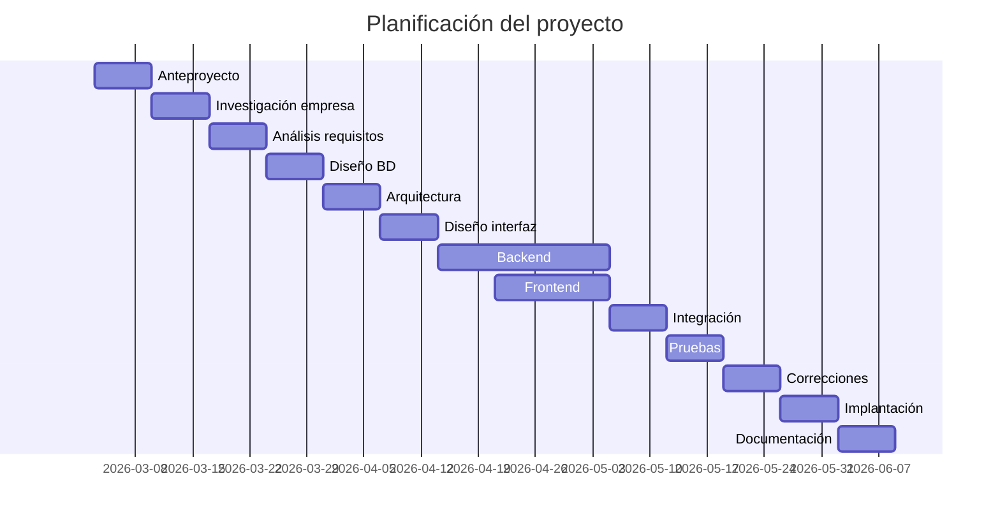

# Anteproxecto

- [Anteproxecto](#anteproxecto)
  - [1- Idea do proxecto](#1--idea-do-proxecto)
  - [2- Contextualización](#2--contextualización)
  - [3- Estudio de alternativas e viabilidade](#3--estudio-de-alternativas-e-viabilidade)
    - [3.1- Estudio de alternativas](#31--estudio-de-alternativas)
    - [Alternativas](#alternativas)
    - [3.2 Xustificación da alternativa](#32-xustificación-da-alternativa)
  - [4- Requirimentos técnicos](#4--requirimentos-técnicos)
    - [Infraestructura](#infraestructura)
    - [Backend](#backend)
    - [Frontend](#frontend)
  - [5- Planificación](#5--planificación)
  - [Planificación del desarrollo del proyecto](#planificación-del-desarrollo-del-proyecto)

## 1- Idea do proxecto

Este proyecto consiste en crear una aplicación web para ayudar a gestionar una empresa de forma más sencilla. La plataforma tendrá diferentes tipos de usuarios, como administrador, contabilidad , logistica y cliente, y cada uno podrá acceder a distintas funciones. Desde la aplicación se podrán ver y gestionar pedidos y consultar información relacionada con la contabilidad, facilitando así la organización de la empresa.

## 2- Contextualización

El proyecto consiste en el desarrollo de una aplicación web destinada a mejorar la gestión interna de una empresa, especialmente en lo relacionado con la gestión de pedidos y el control de cierta información administrativa. La aplicación contará con varios tipos de usuarios o roles: administrador, contabilidad, logística y cliente. Cada uno tendrá acceso a diferentes funcionalidades según sus necesidades. Por ejemplo, los clientes podrán realizar y consultar pedidos, el departamento de logística se encargará de gestionarlos, contabilidad podrá revisar la información económica y el administrador tendrá control general sobre el sistema.

El objetivo principal de la aplicación es centralizar la información de la empresa en una única plataforma, facilitando la organización del trabajo y el acceso a los datos de forma rápida y sencilla.

Además, el desarrollo de esta aplicación podría suponer una oportunidad de negocio, ya que muchas pequeñas y medianas empresas necesitan herramientas de gestión simples y accesibles. La aplicación podría adaptarse a distintas empresas y ofrecerse como un servicio web o como un producto personalizable según las necesidades de cada cliente.

## 3- Estudio de alternativas e viabilidade

### 3.1- Estudio de alternativas

Para el desarrollo de la aplicación web de gestión de pedidos y contabilidad, se han analizado varias alternativas tecnológicas considerando criterios técnicos, económicos, temporalidad y recursos disponibles.

### Alternativas

- **A1 – Desarrollo desde cero con Java Spring Boot + HTML5 + CSS3 + JavaScript nativo**  
- **A2 – Desarrollo desde cero con Node.js + HTML5 + CSS3 + JavaScript nativo**  
- **A3 – Desarrollo desde cero con PHP MVC + HTML5 + CSS3 + JavaScript nativo**  
- **A4 – Desarrollo con Laravel + React.js + Tailwind**  
- **A5 – Desarrollo con Symfony + PHP + JavaScript + CSS + Twig**  

| **Alternativa** |  **Viabilidad técnica** | **Viabilidad económica** | **Temporalidad** | **Valoración Global** |
| ------ | ------ | ------ | ------ | ------ |
| **A1** | Baixa-media (4/10): Java Spring Boot es potente pero con curva de aprendizaje elevada. **Fortalezas:** Arquitectura sólida, escalable, profesional. **Debilidades:** Configuración compleja, tiempo de aprendizaje alto. | Medio (6/10): Necesita hosting con soporte Java o VPS. Software adicional gratuito. | Viabilidad baja (3/10): Desarrollo largo, 4-6 meses. | **5/10** |
| **A2** | Media-Alta (6/10): Node permite construir APIs REST fácilmente. **Fortalezas:** Simplicidad, entorno JavaScript unificado. **Debilidades:** Hay que estructurar bien el proyecto desde cero. | Alta (8/10): Hosting Node.js económico o gratuito disponible. | Viabilidad media (6/10): Duración 2,5-4 meses. | **7/10** |
| **A3** | Media (7/10): PHP MVC es conocido, pero requiere programar rutas, seguridad y validaciones manualmente. **Fortalezas:** Lenguaje conocido. **Debilidades:** Mucho trabajo manual, mantenimiento más difícil que con Symfony. | Alta (9/10): Hosting PHP económico y software gratuito. | Viabilidad media (6/10): Desarrollo 2,5-3 meses. | **7/10** |
| **A4** | Media (6/10): Laravel + React + Tailwind es potente y moderno. **Fortalezas:** Stack profesional y modular. **Debilidades:** No se conoce React ni Tailwind, por lo que habría que invertir tiempo en pruebas y aprendizaje adicional. | Alta (8/10): Herramientas gratuitas, hosting PHP compatible. | Viabilidad baja (5/10): Curva de aprendizaje y configuración elevada, 4-5 meses. | **5/10** |
| **A5** | Alta (9/10): Symfony organiza rutas, seguridad, base de datos y permite usar Twig para plantillas dinámicas. **Fortalezas:** Desarrollo estructurado, seguro, mantenible. **Debilidades:** Requiere conocer Symfony, aunque se ha visto en prácticas. | Alta (8/10): Hosting PHP económico y compatible. | Alta (8/10): Desarrollo más organizado y rápido que PHP nativo, 2-3 meses. | **9/10** |

### 3.2 Xustificación da alternativa

La alternativa **A5 (Symfony + PHP + Twig)** se consolida como la más viable globalmente, y por eso es la elegida, ya que:

- Permite un desarrollo estructurado, seguro y mantenible gracias a las herramientas que ofrece Symfony.
- Aprovecha los conocimientos previos de PHP adquiridos en las prácticas, reduciendo la curva de aprendizaje.
- Facilita la gestión de distintos roles de usuario (administrador, contabilidad, logística y cliente) de manera eficiente.
- Permite crear un prototipo funcional en un tiempo razonable, optimizando el desarrollo frente a PHP nativo.
- No requiere aprender frameworks frontend adicionales, ya que Twig permite crear plantillas dinámicas de forma sencilla.

Las alternativas **A1 (Spring Boot)** y **A4 (Laravel + React + Tailwind)** resultan menos adecuadas debido a su complejidad y tiempo de aprendizaje adicional.  
**A2 (Node.js)** podría considerarse como opción moderna, pero su aprendizaje y configuración desde cero serían más lentos, y **A3 (PHP MVC nativo)** implica demasiado trabajo manual y menos organización del proyecto que Symfony.

## 4- Requirimentos técnicos

Para desarrollar el proyecto se utilizarán las siguientes tecnologías y recursos:

### Infraestructura
- **Hosting:** servidor con soporte PHP 8 y Symfony.  
- **Base de datos:** MySQL para guardar pedidos, usuarios y contabilidad.  
- **Dominio y almacenamiento:** dominio propio y espacio suficiente en el hosting para la aplicación y la base de datos.  

### Backend
- **Lenguaje:** PHP 8  
- **Framework:** Symfony, con Twig para las plantillas.  
- **Gestión de dependencias:** Composer  
- **Base de datos:** MySQL con Doctrine ORM  

### Frontend
- **Lenguajes:** HTML5, CSS3 y JavaScript  
- **Plantillas:** Twig para generar las vistas de manera sencilla  
- **Estilo:** CSS básico, sin frameworks adicionales  

## 5- Planificación

## Planificación del desarrollo del proyecto

| Fase / Tarea | Fecha de inicio | Duración estimada | Fecha fin | Descripción |
|---|---|---|---|---|
| Definición de la idea y anteproyecto | 03/03/2026 | 1 semana | 10/03/2026 | Redacción del anteproyecto, definición inicial del proyecto y recopilación de información. |
| Investigación del contexto / empresa | 10/03/2026 | 1 semana | 17/03/2026 | Investigación sobre el sector, análisis de proyectos similares y estudio de las necesidades que resolverá la aplicación. |
| Análisis de requisitos | 17/03/2026 | 1 semana | 24/03/2026 | Identificación de funcionalidades, definición de usuarios, casos de uso y requisitos del sistema. |
| Diseño de la base de datos | 24/03/2026 | 1 semana | 31/03/2026 | Modelado de entidades, relaciones y estructura de la base de datos. |
| Diseño de la arquitectura | 31/03/2026 | 1 semana | 07/04/2026 | Definición de la arquitectura del sistema y organización del proyecto en Symfony. |
| Diseño de interfaz | 07/04/2026 | 1 semana | 14/04/2026 | Creación de wireframes, prototipo de interfaz y diseño de navegación. |
| Desarrollo backend | 14/04/2026 | 3 semanas | 05/05/2026 | Implementación de lógica del sistema, controladores, entidades y servicios en Symfony. |
| Desarrollo frontend | 21/04/2026 | 2 semanas | 05/05/2026 | Creación de vistas con Twig, formularios y estilos de la aplicación. |
| Integración del sistema | 05/05/2026 | 1 semana | 12/05/2026 | Conexión entre frontend, backend y base de datos. |
| Pruebas del sistema | 12/05/2026 | 1 semana | 19/05/2026 | Pruebas funcionales del sistema, detección de errores y validación de funcionalidades. |
| Corrección de errores | 19/05/2026 | 1 semana | 26/05/2026 | Ajustes finales y optimización del sistema. |
| Implantación | 26/05/2026 | 1 semana | 02/06/2026 | Configuración en servidor de producción y despliegue del proyecto. |
| Documentación final | 02/06/2026 | 1 semana | 09/06/2026 | Elaboración de manual técnico, manual de usuario y memoria final. |

[**<-Anterior**](../README.md)

