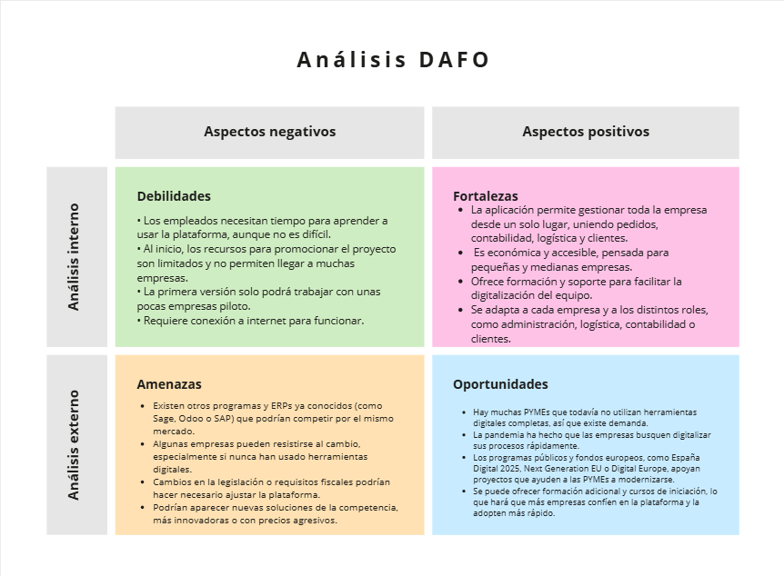

# 1- Empresa

- [1- Empresa](#1--empresa)
  - [1.1- Idea de negocio](#11--idea-de-negocio)
  - [1.2- Xustificación da idea](#12--xustificación-da-idea)
  - [1.3- Segmento de clientes](#13--segmento-de-clientes)
  - [1.4- Competencia](#14--competencia)
  - [1.5- Proposta de valor](#15--proposta-de-valor)
  - [1.6- Forma xurídica](#16--forma-xurídica)
  - [1.7- Investimentos](#17--investimentos)
    - [1.7.1- Custos](#171--custos)
    - [1.7.2- Ingresos](#172--ingresos)
      - [Comentarios de viabilidad](#comentarios-de-viabilidad)
  - [1.8- Viabilidade](#18--viabilidade)
    - [1.8.1- Viabilidade técnica](#181--viabilidade-técnica)
    - [1.8.2 - Viabilidade económica](#182---viabilidade-económica)
    - [1.8.3- Conclusión](#183--conclusión)

## 1.1- Idea de negocio

La idea de negocio consiste en crear una **aplicación web de gestión empresarial para PYMEs**, que centralice la información de la empresa en un único sistema. La plataforma permitirá a los distintos usuarios de la empresa (administrador, contabilidad, logística y cliente) acceder a funcionalidades específicas según su rol.  

**Producto central:**  
- Gestión de pedidos: registro, seguimiento y control en tiempo real.  
- Gestión contable: control de facturas, gastos y ingresos.  
- Gestión logística: asignación de pedidos, seguimiento de envíos y control de inventario.  
- Generación de informes y documentos PDF para clientes y administración interna.  

**Valor añadido:**  
- Centralización de información para mejorar la organización interna.  
- Comunicación en tiempo real entre departamentos mediante actualizaciones automáticas.  
- Reducción de errores humanos y duplicidad de datos.  
- Plataforma accesible y personalizable para distintas PYMEs, sin requerir inversión en sistemas complejos.  

**Utilidad:**  
- Facilita la gestión interna de la empresa.  
- Permite a los clientes consultar sus pedidos y facturas de forma directa.  
- Aumenta la eficiencia operativa y reduce costes administrativos.  

**Posibles productos aumentados o complementarios:**  
- Integración con servicios de correo electrónico para notificaciones automáticas.  
- Pantalla de estadísticas para la toma de decisiones estratégicas.  
- Módulo de facturación electrónica adaptado a normativas locales.
- **Cursos de iniciación para usuarios y clientes**, con tutoriales paso a paso para el uso de la plataforma y formación básica en gestión de pedidos y contabilidad.

## 1.2- Xustificación da idea

La idea de proyecto surge de la necesidad de **facilitar la gestión integral de pequeñas y medianas empresas (PYMEs)**, que a menudo dependen de herramientas dispersas o procesos manuales para controlar pedidos, contabilidad y logística.  

**Necesidades que se pretenden cubrir:**  
- Centralización de la información de la empresa en un único sistema accesible para todos los departamentos.  
- Gestión eficiente de pedidos, logística y contabilidad sin duplicidad de datos.  
- Comunicación en tiempo real entre los distintos roles de la empresa y con los clientes.  
- Generación automática de documentos e informes que permitan el control económico y logistíco.  
- **Control de inventario** en tiempo real para evitar faltantes o exceso de stock.  
- **Gestión de clientes y proveedores**, manteniendo un registro actualizado de contactos y transacciones.  
- **Acceso remoto seguro**, permitiendo que los empleados trabajen desde cualquier lugar.  
- **Reducción de errores humanos** mediante automatización de procesos rutinarios.  
- **Formación y soporte a usuarios**, con cursos de iniciación y tutoriales para facilitar la adopción del sistema.

**Situación actual y oportunidad de mercado:**  
Según el informe **[España Digital 2025](https://www.lamoncloa.gob.es/presidente/actividades/Documents/2020/230720-Espa%C3%B1aDigital_2025.pdf)**, gran parte de las PYMEs españolas **carece de recursos y competencias** para implementar tecnologías digitales de manera eficaz en sus procesos de producción, distribución y gestión. Esto evidencia un **segmento de mercado insuficientemente atendido** y con alta demanda de soluciones digitales accesibles, centralizadas y fáciles de usar.  

Además, los fondos europeos **Next Generation EU**, y programas como **Horizon Europe** y **Digital Europe**, fomentan la modernización digital y la innovación tecnológica en PYMEs, reforzando la **viabilidad y oportunidad de negocio** de este proyecto. La propuesta ofrece una plataforma integral que permite mejorar la productividad, eficiencia y competitividad de las empresas, contribuyendo al desarrollo económico y a la inclusión digital.

**Aplicaciones o productos existentes:**  
Herramientas como **Sage, FacturaDirecta**, o ERPs como **Odoo y SAP Business One**, así como plataformas más asequibles como **Holded**, ofrecen funcionalidades similares. Sin embargo:  
- Algunas soluciones son **costosas** y requieren formación especializada (Sage, SAP).  
- Suelen ser **demasiado complejas** para PYMEs pequeñas o medianas.  
- No siempre ofrecen **actualización en tiempo real** ni módulos **personalizados según el tipo de usuario**.  
- Las plataformas económicas como Holded, aunque accesibles, no siempre integran todas las funciones de **gestión integral de pedidos, logística y contabilidad**, ni facilitan la creación de informes dinámicos o generación automática de documentos.

**Análisis DAFO:**

## 1.3- Segmento de clientes

La aplicación está dirigida principalmente a **pequeñas y medianas empresas (PYMEs)** que necesiten una solución sencilla e integral para gestionar su actividad diaria. El objetivo es facilitar la digitalización de procesos como pedidos, contabilidad, logística y atención al cliente, especialmente en empresas que actualmente dependen de métodos manuales o herramientas fragmentadas.

**Segmentos de clientes:**  
- **Pequeñas empresas**: con menos de 50 empleados, que suelen tener recursos limitados y necesitan soluciones económicas y fáciles de implementar.  
- **Medianas empresas**: con entre 50 y 250 empleados, que requieren un control más organizado de procesos internos y comunicación entre departamentos.  
- **Empresas con baja digitalización**: aquellas que aún no utilizan herramientas integrales de gestión y se benefician especialmente de la formación y soporte incluidos.  

**Diferencia entre usuario y cliente:**  
- **Cliente**: la empresa que contrata el servicio o la licencia de la plataforma.  
- **Usuario**: las personas dentro de la empresa que utilizarán la aplicación: administradores, contables, personal de logística y clientes que hagan pedidos o consulten información.  

**Cuantificación aproximada del mercado:**  
En España, según datos del INE (2024), existen aproximadamente **3,3 millones de empresas**, de las cuales **el 99% son PYMEs**, siendo un mercado muy amplio para soluciones de digitalización.  

Este proyecto se centra en captar inicialmente una **parte pequeña del mercado**, con planes de expansión gradual a medida que la plataforma se consolide y se adapte a las necesidades de diferentes tipos de empresas.

## 1.4- Competencia
En el mercado actual existen diversas soluciones de software que ayudan a las empresas a gestionar pedidos, contabilidad y logística. Entre las más conocidas se encuentran:

- **Sage**: Un software consolidado con gran presencia en el mercado español y europeo. Se orienta principalmente a empresas medianas y grandes. Es potente y completo, pero suele ser **costoso** y requiere **formación especializada**.  
- **Odoo**: ERP modular que permite integrar distintos procesos empresariales. Ofrece flexibilidad y múltiples módulos, pero su **personalización y despliegue pueden ser complejos** para PYMEs pequeñas sin soporte técnico.  
- **SAP Business One**: Solución ERP robusta, enfocada a empresas medianas. Es **muy completa**, pero el coste y la implementación suelen ser elevados, lo que dificulta su adopción por empresas pequeñas.  
- **Holded**: Plataforma económica y accesible para PYMEs, centrada en contabilidad, facturación y gestión básica de proyectos. Aunque es asequible, **no integra todas las funciones** de manera centralizada ni ofrece personalización avanzada por roles.  
- **FacturaDirecta**: Herramienta sencilla para facturación y control contable. Es útil para autónomos y pequeñas empresas, pero **carece de funciones integrales** para logística, gestión de pedidos y comunicación entre departamentos.  

**Análisis del mercado:**  
- La mayoría de estas soluciones **no está completamente adaptada a las pequeñas PYMEs** que buscan un sistema económico, fácil de usar y que centralice todos los procesos.  
- Existe un segmento de mercado **insuficientemente atendido**, especialmente empresas con **baja digitalización** que necesitan formación, soporte y herramientas sencillas.  
- La competencia se centra en ofrecer funcionalidades parciales, precios altos o soluciones complejas. Esto deja espacio para una **plataforma integral, asequible y fácil de adoptar**, que incluya soporte y cursos de iniciación.  

**Posicionamiento de la nueva idea:**  
- La plataforma propuesta se diferenciará por ser **económica, modular, intuitiva y personalizada según roles**, con formación incluida para facilitar la digitalización.  
- Se dirige a **PYMEs pequeñas y medianas**, especialmente aquellas que todavía no cuentan con herramientas integrales de gestión y que buscan mejorar la productividad y el control de su empresa.  

## 1.5- Proposta de valor

Ayudamos a **pequeñas y medianas empresas** a gestionar sus pedidos, contabilidad, logística y clientes en un **solo lugar**, con **actualización en tiempo real** y **personalización por roles**. Nuestra plataforma es **intuitiva y asequible**, incluye **formación y soporte**, y permite a las empresas **ahorrar tiempo, reducir errores y mejorar su productividad**, diferenciándose de soluciones más costosas o complejas del mercado.

## 1.6- Forma xurídica

Para poner en marcha esta plataforma, se propone crear la empresa como una **Sociedad de Responsabilidad Limitada (SL)**.

**Por qué esta forma jurídica:**  
- Los socios solo responden con el capital que aportan, lo que **reduce riesgos personales**.  
- Es **sencilla de gestionar** en cuanto a trámites fiscales y administrativos.  
- Permite que la empresa **crezca de manera organizada**, incorporando nuevos socios si hace falta.  

## 1.7- Investimentos

Para poner en marcha la plataforma en **O Salnés, Galicia**, se necesitarán los siguientes recursos e inversiones:  

- **Local y mobiliario:**  
  - Mesas, sillas, estanterías y mobiliario básico: 800 € aprox.  
  - Suministros de oficina (papel, material de escritura, etc.): 300 € aprox.  

- **Infraestructura tecnológica:**  
  - Servidor web o hosting en la nube: 500 € aprox./año  
  - Dominio web: 15 € aprox./año  
  - Certificado SSL: gratuito (Let's Encrypt) o 50 € aprox./año  

- **Equipos y dispositivos:**  
  - Ordenadores para el equipo de desarrollo (2-3 unidades): 1.500 € aprox.  
  - Dispositivos móviles para pruebas (tablets y smartphones): 500 € aprox.  

- **Software y herramientas:**  
  - Licencias de desarrollo y edición (IDE, herramientas gráficas): 200 € aprox.  
  - Bases de datos y sistemas auxiliares (MySQL, Docker, GitHub): gratuitos o 100 € aprox./año para servicios premium  

- **Marketing y lanzamiento:**  
  - Campañas iniciales en redes sociales y Google Ads: 300 € aprox.  
  - Material de promoción digital y diseño gráfico: 200 € aprox.  

**Total aproximado de inversión inicial:** 4.865 €  

### 1.7.1- Custos
**Se distinguen los siguientes **costos fijos y variables**:  
**Costos fijos (mensuales):**  
- Alquiler de oficina: 400 €  
- Suministros de oficina (agua, electricidad, internet): 100 €  
- Hosting web y dominio: 50 €  
- Sueldos del personal: 5.710 € (2 desarrolladores + 1 administrativo)  
- Seguridad Social y cargas sociales: 1.713 € aprox.  

**Costos variables (según actividad):**  
- Material de oficina adicional: 20-50 €  
- Campañas de marketing y publicidad: 300 € (puede variar según campañas)  
- Licencias de software o herramientas premium: 50-100 €  

**Total estimado mensual:** 7.633 € aprox.  
**Total anual (sumando impuestos y costes sociales):** 91.596 € aprox. 

### 1.7.2- Ingresos

Para calcular los ingresos estimados del negocio, se propone una **política de precios basada en suscripción mensual**, considerando que la plataforma se dirige a pequeñas y medianas empresas en Galicia, especialmente en O Salnés.

La previsión de clientes para el primer año es la siguiente:
- **Básica:** 70 empresas × 50 €/mes × 12 meses = 42.000 €  
- **Estándar:** 30 empresas × 100 €/mes × 12 meses = 36.000 €  
- **Avanzada:** 12 empresas × 200 €/mes × 12 meses = 28.800 €  

**Ingresos por subvenciones iniciales:** 10.000 € Igape Innova  

**Total ingresos anuales:** 116.800 €  
**Total ingresos mensuales promedio:** 116.800 ÷ 12 ≈ 9.733 €/mes  

#### Comentarios de viabilidad
- Estos ingresos cubren de sobra los costes mensuales estimados (7.633 €/mes), dejando un beneficio neto aproximado de 2.100 €/mes.  
- El negocio será **rentable desde el primer año**, pudiendo reinvertir o crecer según aumente la base de clientes.  
- Además, se pueden ofrecer **servicios adicionales** (formación, soporte premium o módulos personalizados) para aumentar ingresos y atraer más empresas.  
- La inclusión de **subvenciones para nuevos emprendedores** proporciona un colchón adicional que asegura la viabilidad económica incluso ante retrasos en la captación de clientes.

## 1.8- Viabilidade

### 1.8.1- Viabilidade técnica

**Recursos humanos**
- El equipo necesario incluye: 
  - 1 programador/desarrollador backend
  - 1 programador frontend
  - 1 administrativa
- Todos los perfiles son factibles de contratar en la zona de O Salnés o trabajar de forma remota.
- Los sueldos están ya contemplados en la previsión de costes y permiten atraer talento cualificado.

**Medios de producción**
- La aplicación se desarrollará en un entorno virtual, con servidores en la nube y base de datos MySQL, por lo que no se necesitan instalaciones físicas complejas.
- El equipo de desarrollo dispondrá de ordenadores y software estándar (PHP, Symfony, Git, etc.), todos de acceso fácil y económico.
- No se requieren materias primas ni maquinaria especial.

**Impedimentos técnicos**
- No se identifican impedimentos técnicos significativos: 
  - Las tecnologías seleccionadas son maduras y bien documentadas (Symfony, Twig, MySQL).
  - El proyecto no depende de hardware complejo ni de suministros externos críticos.
  - La escalabilidad futura está contemplada mediante soluciones en la nube.

**Conclusión**
- **La viabilidad técnica del proyecto es alta.** Los recursos humanos y tecnológicos necesarios están disponibles, y no existen dificultades técnicas que impidan la ejecución del proyecto.

### 1.8.2 - Viabilidade económica

- Costes totales: 91.596 €/año  
- Ingresos previstos: 106.800 €/año  
- Beneficio neto anual estimado: 15.204 €  
- Margen suficiente para operar y reinvertir, con flexibilidad para optimizar costes variables.

### 1.8.3- Conclusión
El proyecto es viable tanto técnica como económicamente. Permite operar con un margen suficiente y tiene capacidad de crecer y escalar a largo plazo. Además, existen subvenciones para nuevas empresas que pueden ayudar a cubrir costes iniciales si fuese necesario. Esto asegura que el proyecto pueda mantenerse rentable incluso ante imprevistos y permite reinvertir en su expansión futura.

[**<-Anterior**](../../README.md)
