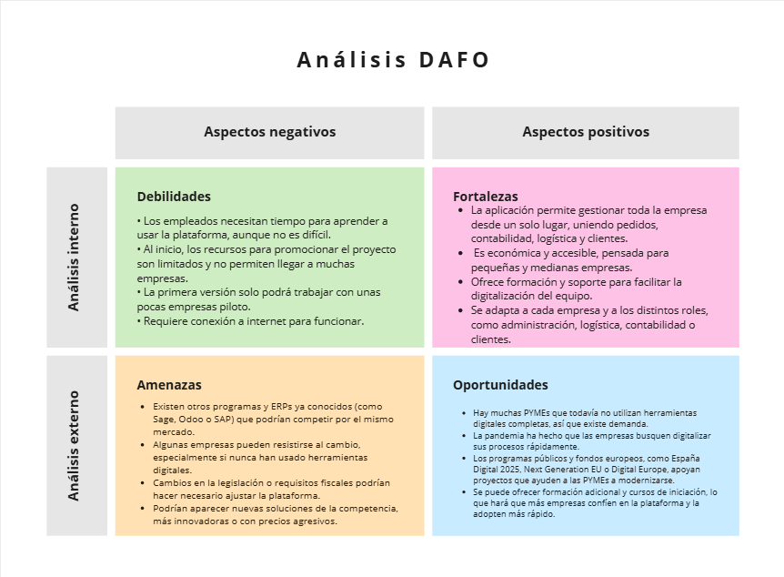

# 1- Empresa

- [1- Empresa](#1--empresa)
  - [1.1- Idea de negocio](#11--idea-de-negocio)
  - [1.2- Xustificación da idea](#12--xustificación-da-idea)
  - [1.3- Segmento de clientes](#13--segmento-de-clientes)
  - [1.4- Competencia](#14--competencia)
  - [1.5- Proposta de valor](#15--proposta-de-valor)
  - [1.6- Forma xurídica](#16--forma-xurídica)
  - [1.7- Investimentos](#17--investimentos)
    - [1.7.1- Custos](#171--custos)
    - [1.7.2- Ingresos](#172--ingresos)
      - [Comentarios de viabilidad](#comentarios-de-viabilidad)
  - [1.8- Viabilidade](#18--viabilidade)
    - [1.8.1- Viabilidade técnica](#181--viabilidade-técnica)
    - [1.8.2 - Viabilidade económica](#182---viabilidade-económica)
    - [1.8.3- Conclusión](#183--conclusión)

## 1.1- Idea de negocio

La idea de negocio consiste en crear una **aplicación web de gestión empresarial especializada para empresas del sector del mar** (distribuidoras de marisco, depuradoras, comercializadoras de pescado y conserveras). La plataforma centraliza la información del negocio en un único sistema accesible según el rol del usuario (administrador, contabilidad, logísticay cliente de tienda).

**Producto central:** 
- **Gestión de pedidos de tienda:** Registro, seguimiento y control de pedidos de pescado y marisco fresco en tiempo real.  
- **Gestión contable y documental:** Control de gastos, ingresos, facturación y **descarga automática de albaranes y facturas** adaptadas al sector.  
- **Logística y control de almacén:** Control del stock y preparación de pedidos.  
- **Generación de informes:** Documentos PDF listos para descarga (albaranes de entregas y facturas oficiales).

**Valor añadido:**   
- **Comunicación en tiempo real:** Conexión directa mediante actualizaciones automáticas entre lo que se vende en la tienda y el stock real del almacén.  
- **Digitalización ágil:** Generación y descarga inmediata de albaranes y facturas en formato digital, reduciendo el papeleo en oficina.  
- **Soporte y formación:** Cursos de iniciación para que los trabajadores del sector del mar y sus clientes se adapten rápidamente a la plataforma sin complicaciones.

**Utilidad:** 
- Automatiza el día a día de las empresas del mar (trazabilidad, almacén y facturas).  
- Permite a las pescaderías o restaurantes clientes consultar el catálogo, hacer pedidos de tienda y descargarse sus propias facturas de forma directa.  
- Reduce los errores humanos al apuntar pedidos o gestionar el stock del almacén.

**Posibles productos aumentados o complementarios:** 
- Módulo de trazabilidad automatizada, etiquetado obligatorio para pescados y mariscos.  
- Integración con básculas digitales para actualizar el peso real del producto directamente en el albarán.  
- Cursos de formación digital enfocados a profesionales del sector marino para romper la brecha digital.

## 1.2- Xustificación da idea

La idea surge al detectar que muchas **PYMEs del sector del mar** (especialmente en zonas costeras como Galicia) siguen gestionando sus albaranes, pedidos y almacén de forma manual, en papel o con hojas de cálculo dispersas. Al trabajar con producto fresco y precedero, la falta de control en tiempo real del almacén provoca pérdidas de stock o retrasos en las entregas.

**Necesidades que se pretenden cubrir:**
 - **Control de almacén estricto:** Gestión de stock en tiempo real para evitar roturas de stock o mermas de producto marino.  
- **Agilidad documental:** Descarga rápida de albaranes y facturas para agilizar las cargas de los transportistas que van a las lonjas o mercados centrales.  
- **Centralización en un solo sistema:** Unir la tienda, la contabilidad de la empresa y la logística del almacén bajo una misma plataforma.  
- **Reducción de errores administrativos:** Automatizar la conversión de un pedido de tienda en un albarán de entrega y, posteriormente, en su factura correspondiente.  
- **Acceso remoto seguro:** Permitir que los comerciales o repartidores consulten el stock de la empresa desde cualquier sitio (móvil o tablet).  
  

**Aplicaciones o productos existentes:** ERPs gigantes como **SAP** o **Odoo**, o programas como **Holded** y **Sage** ofrecen gestión de stock y facturas. Sin embargo:  
- Son sistemas **genéricos** (sirven igual para una tienda de ropa que para una ferretería) y no entienden las necesidades específicas del mar (trazabilidad, mermas de peso fresco, rapidez en albaranes de lonja).  
- Tienen un coste elevado y una configuración muy compleja que requiere semanas de formación.  
- Nuestra propuesta es un sistema **especializado, asequible, que incluye formación** y que va directo al grano: pedidos de tienda, almacén, albaranes y facturas descargables.

**Situación actual y oportunidad de mercado:**  
Según el informe **[España Digital 2025](https://www.lamoncloa.gob.es/presidente/actividades/Documents/2020/230720-Espa%C3%B1aDigital_2025.pdf)**, gran parte de las PYMEs españolas **carece de recursos y competencias** para implementar tecnologías digitales de manera eficaz en sus procesos de producción, distribución y gestión. Esto evidencia un **segmento de mercado insuficientemente atendido** y con alta demanda de soluciones digitales accesibles, centralizadas y fáciles de usar.  

Estando ubicados en **O Salnés (Galicia)**, nos encontramos en el corazón de la producción marisquera y pesquera de las Rías Baixas. Existe un mercado enorme de pequeñas depuradoras, cocederos y distribuidores locales que necesitan dar el salto digital pero rechazan programas genéricos. Además, las ayudas europeas **Next Generation EU** y los planes de modernización pesquera ofrecen la oportunidad perfecta, ya que estas empresas reciben subvenciones directas para contratar este tipo de software.

**Análisis DAFO:**

## 1.3- Segmento de clientes

La aplicación está diseñada para **PYMEs y pequeños negocios del sector del mar** situados principalmente en zonas costeras e industriales de Galicia.

**Segmentos de clientes:** 
- **Pequeñas depuradoras y cocederos de marisco:** Que necesitan controlar qué entra, qué hay en el almacén de frío y qué sale hacia los clientes.  
- **Distribuidores y mayoristas de pescado fresco:** Empresas que compran en lonja y venden a restaurantes, pescaderías o cadenas de supermercados, y necesitan generar albaranes de reparto masivos.  
- **Conserveras locales y comercializadoras:** Negocios que tienen una tienda (física o web) y necesitan que las ventas de pedidos resten stock automáticamente del almacén general.  

**Diferencia entre usuario y cliente:** 
- **Cliente:** La empresa del mar (depuradora, distribuidor) que paga la suscripción mensual del software.  
- **Usuario:** El operario de almacén que prepara los palets, el contable que emite las facturas, el administrador de la empresa y los propios clientes finales (pescaderías/restaurantes) que entran a la app a hacer pedidos de tienda y descargar sus albaranes.

**Cuantificación aproximada del mercado:** Galicia concentra la mayor actividad pesquera y marisquera de España. Solo en la comarca de **O Salnés y alrededores** existen cientos de pequeñas empresas dedicadas a la comercialización de productos del mar que entran dentro de nuestro perfil de cliente ideal.

## 1.4- Competencia

- **Software Genérico (Holded, FacturaDirecta):** Son baratos y estéticos, pero se quedan muy cortos. No manejan bien la logística de almacenes de frío ni la trazabilidad alimentaria, y sus albaranes no están pensados para el transporte de mercancía perecedera.  
- **Grandes ERPs (Sage, Odoo, SAP Business One):** Son muy potentes y cubren todo, pero sus precios son prohibitivos para una pequeña empresa familiar del mar. Además, configurarlos es tan difícil que los trabajadores suelen abandonar su uso.  
- **Software sectorial a medida:** Existen algunas consultoras que hacen programas a medida para grandes conserveras, pero requieren inversiones iniciales de miles de euros que una pequeña PYME no se puede permitir.

**Posicionamiento de la nueva idea:** Nos posicionamos justo en el medio: ofrecemos la **especialización y control de albaranes/almacén del sector del mar** que tienen los programas caros, pero con la **facilidad de uso y el precio asequible por suscripción** de las herramientas modernas.
 

## 1.5- Proposta de valor

Ayudamos a **pequeñas y medianas empresas** a gestionar sus pedidos, contabilidad, logística y clientes en un **solo lugar**, con **actualización en tiempo real** y **personalización por roles**. Nuestra plataforma es **intuitiva y asequible**, incluye **formación y soporte**, y permite a las empresas **ahorrar tiempo, reducir errores y mejorar su productividad**, diferenciándose de soluciones más costosas o complejas del mercado.

## 1.6- Forma xurídica

Para poner en marcha esta plataforma, se propone crear la empresa como una **Sociedad de Responsabilidad Limitada (SL)**.

**Por qué esta forma jurídica:** 
- Los socios solo responden con el capital aportado (mínimo legal), protegiendo sus bienes personales.  
- Es la estructura idónea para vender software como servicio (SaaS) a otras empresas.  
- Ofrece una imagen seria y profesional ante las empresas del mar y permite solicitar subvenciones tecnológicas de la Xunta de Galicia o el IGAPE de forma más ágiles.

## 1.7- Investimentos

Para poner en marcha la plataforma en **O Salnés, Galicia**, se necesitarán los siguientes recursos e inversiones iniciales:  

- **Local y mobiliario:**  
  - Mesas, sillas, estanterías y mobiliario básico: 800 € aprox.  
  - Suministros de oficina (papel, material de escritura, etc.): 300 € aprox.  

- **Infraestructura tecnológica:**  
  - Servidor web o hosting en la nube: 500 € aprox./año  
  - Dominio web: 15 € aprox./año  
  - Certificado SSL: gratuito (Let's Encrypt)  

- **Equipos y dispositivos:**  
  - Ordenadores para el equipo de desarrollo (2-3 unidades): 1.500 € aprox.  
  - Dispositivos móviles para pruebas (tablets y smartphones): 500 € aprox.  

- **Software y herramientas:**  
  - Licencias de desarrollo y edición (IDE, herramientas gráficas): 200 € aprox.  
  - Bases de datos y sistemas auxiliares (MySQL, Docker, GitHub): 100 € aprox./año para servicios premium  

- **Marketing y lanzamiento:**  
  - Campañas iniciales en redes sociales y Google Ads: 300 € aprox.  
  - Material de promoción digital y diseño gráfico: 200 € aprox.  

**Total aproximado de inversión inicial:** 4.415 €  

### 1.7.1- Custos

Se distinguen los siguientes costos fijos y variables basados en la actividad mensual de la empresa:  

**Costos fijos (mensuales):**  
- Alquiler de pequeña oficina: 400 €  
- Suministros (Luz, internet de alta velocidad, agua): 100 €  
- Infraestructura Cloud (Servidores Symfony + Hub Mercure en producción): 50 €  
- Sueldos del equipo (2 desarrolladores/soporte + 1 administrativo): 5.710 €  
- Seguridad Social y cargas sociales: 1.713 €  
*Subtotal Costos Fijos:* 7.973 €/mes  

**Costos variables (mensuales promedio):**  
- Material de oficina adicional: 35 € (promedio de la horquilla 20-50 €)  
- Desplazamientos a empresas/puertos para instalaciones y formación: 100 €  
- Campañas de marketing y publicidad: 300 €  
- Licencias de software o herramientas premium: 75 € (promedio de la horquilla 50-100 €)  
*Subtotal Costos Variables:* 510 €/mes  

**Total estimado mensual (Fijos + Variables):** 8.483 € aprox.  
**Total anual estimado (Multiplicado por 12 meses):** 101.796 € aprox.

### 1.7.2- Ingresos

El modelo de ingresos se basa estrictamente en el pago por uso real de la plataforma, dividiéndose en una cuota fija por trabajador y un suplemento según el volumen de documentos de transporte y facturas que gestione la empresa:

  **Precio por Usuario (Asiento):** 7,99 € / mes por cada cuenta de trabajador activa (personal de administración, comerciales, operarios de almacén de frío, transportistas propios). *Nota: Los clientes de la tienda que entran a hacer pedidos o descargar albaranes tienen acceso gratuito.*
  **Suplementos por Tráfico (Volumen mensual de albaranes y facturas generadas):**
    *Tramo 1 (Hasta 350 documentos/mes):* Gratis (Incluido en la cuota base).
    *Tramo 2 (De 351 a 650 documentos/mes):* +30 € / mes. 
    *Tramo 3 (De 651 a 950 documentos/mes):* +50 € / mes.
    *Tramo 4 (Más de 950 documentos/mes):* +70 € / mes.

**Previsión de clientes para el primer año en Galicia:**  
- **30 Empresas Pequeñas** (Promedio: 5 usuarios [40€] + Tramo 1 [0€]): 30 empresas × 40 €/mes × 12 meses = 14.400 €  
- **40 Empresas Medianas** (Promedio: 12 usuarios [96€] + Tramo 2 [30€]): 40 empresas × 126 €/mes × 12 meses = 60.480 €  
- **12 Empresas Grandes** (Promedio: 25 usuarios [200€] + Tramo 4 [70€]): 12 empresas × 270 €/mes × 12 meses = 38.880 €  
- **Subvención Inicial (IGAPE / Kit Digital):** 10.000 €  

**Total ingresos primer año:** 123.760 €  
**Total ingresos mensuales promedio:** ≈ 10.313 €/mes  

#### Comentarios de viabilidad
- Al ajustar los costes con los datos reales, vemos que los ingresos mensuales promedio (**10.313 €**) siguen estando bastante por encima de los costes totales mensuales de la S.L. (**8.483 €**), lo que nos deja un colchón de beneficio neto de casi **1.830 € al mes** desde el primer año.
- Con el beneficio neto del primer año (que asciende a unos 21.964 € sumando la facturación y la subvención, y restando los costes anuales), se recupera y amortiza de sobra la inversión inicial de **4.415 €** necesaria para comprar los ordenadores y montar la oficina.
- El negocio es económicamente muy sólido: la cuota de 8 € por usuario hace que sea baratísimo para las empresas unirse, pero a nosotros nos asegura la estabilidad financiera para mantener los servidores cloud y pagar las nóminas sin ahogarnos.

## 1.8- Viabilidade

### 1.8.1- Viabilidade técnica

**Recursos humanos**
- El equipo necesario incluye: 
  - 1 programador/desarrollador backend
  - 1 programador frontend
  - 1 administrativa
- Todos los perfiles son factibles de contratar en la zona de O Salnés o trabajar de forma remota.
- Los sueldos están ya contemplados en la previsión de costes y permiten atraer talento cualificado.

**Medios de producción**
- La aplicación se desarrollará en un entorno virtual, con servidores en la nube y base de datos MySQL, por lo que no se necesitan instalaciones físicas complejas.
- El equipo de desarrollo dispondrá de ordenadores y software estándar (PHP, Symfony, Git, etc.), todos de acceso fácil y económico.
- No se requieren materias primas ni maquinaria especial.

**Impedimentos técnicos**
- No se identifican impedimentos técnicos significativos: 
  - Las tecnologías seleccionadas son maduras y bien documentadas (Symfony, Twig, MySQL).
  - El proyecto no depende de hardware complejo ni de suministros externos críticos.
  - La escalabilidad futura está contemplada mediante soluciones en la nube.

**Conclusión**
- **La viabilidad técnica del proyecto es alta.** Los recursos humanos y tecnológicos necesarios están disponibles, y no existen dificultades técnicas que impidan la ejecución del proyecto.

### 1.8.2 - Viabilidade económica

- **Costes totales:** 101.796 €/año  
- **Ingresos previstos (Suscripciones + Subvención):** 123.760 €/año  
- **Beneficio neto anual estimado (Primer año):** 21.964 €  
- **Retorno de la inversión:** La inversión inicial de 4.415 € se recupera por completo dentro de los primeros meses de actividad gracias al beneficio neto positivo.
- **Margen de maniobra:** Contamos con un colchón mensual de casi 1.830 € que otorga a la S.L. un margen suficiente para operar con tranquilidad, asumir picos de tráfico en el servidor y absorber posibles retrasos en los cobros.

### 1.8.3- Conclusión
El proyecto enfocado al sector del mar es totalmente viable tanto técnica como económicamente. Resuelve una necesidad real y urgente en las PYMEs de nuestra costa mediante un modelo de pago por uso que resulta muy asumible para los clientes. 

Económicamente, la empresa opera en positivo desde el primer año, cubre de sobra los costes de personal y permite recuperar la inversión inicial rápidamente. Además, gracias a que la plataforma está desarrollada desde la base para soportar **varios idiomas**, se abren dos grandes vías de expansión a medio plazo:

1.  **Mercado Galegofalante:** Permite adaptarnos al 100% a la realidad cultural de Galicia, ofreciendo una herramienta en gallego para todas aquellas cooperativas, cofradías y PYMEs marineras que prefieren gestionar su negocio en su idioma propio.
2.  **Resto de España:** Al poder cambiar el idioma de la interfaz de forma nativa y limpia, el software es perfectamente escalable para dar el salto a cualquier otra comunidad autónoma con costa y puertos (como Asturias, Cantabria, País Vasco, Andalucía o la Comunidad Valenciana), aumentando nuestra base de clientes sin necesidad de rediseñar la aplicación.
3. **Resto del mundo** Al tener varias opciones de lenguaje se puede poner la aplicación en cualquier lengua del mundo por lo que se podria imprantar en muchos mas lugares.

Esto asegura que el proyecto no solo sea rentable en nuestro entorno local de O Salnés, sino que cuenta con una gran capacidad de crecimiento y escalabilidad a largo plazo.

[**<-Anterior**](../../README.md)
