# FASE DE DESEÑO

- [FASE DE DESEÑO](#fase-de-deseño)
  - [1- Diagrama da arquitectura](#1--diagrama-da-arquitectura)
  - [2- Casos de uso](#2--casos-de-uso)
    - [Admin](#admin)
    - [Contabilidad](#contabilidad)
    - [Logística](#logística)
    - [Cliente](#cliente)
  - [3- Diagrama de Base de Datos](#3--diagrama-de-base-de-datos)
  - [4- Deseño de interface de usuarios](#4--deseño-de-interface-de-usuarios)
    - [Pantalla registro](#pantalla-registro)
    - [Pantalla Login](#pantalla-login)
    - [Pantalla Admin](#pantalla-admin)
    - [Pantalla Contabilidad](#pantalla-contabilidad)
    - [Pantalla Logística](#pantalla-logística)
      - [Flujo de navegación por roles en la aplicación web](#flujo-de-navegación-por-roles-en-la-aplicación-web)
      - [Pantalla inicial: Login](#pantalla-inicial-login)
      - [Clientes](#clientes)
      - [Administrador](#administrador)
      - [Contabilidad](#contabilidad-1)
      - [Logística](#logística-1)

> *EXPLICACIÓN:* Este documento inclúe os diferentes diagramas, esquemas e deseños que axuden a describir mellor o [nome do proxecto] detallando os seus compoñentes, funcionalidades, bases de datos e interface.

## 1- Diagrama da arquitectura

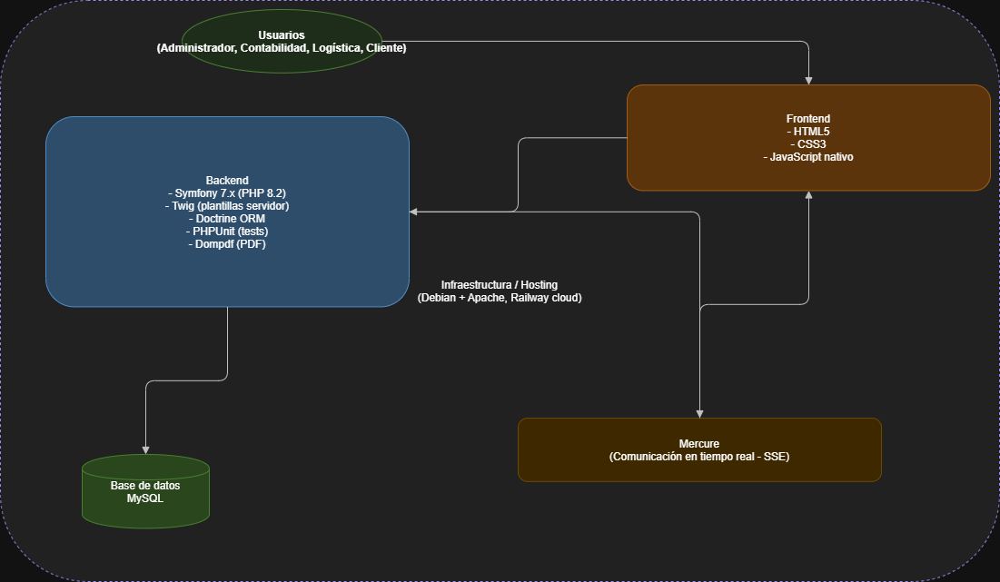

## 2- Casos de uso

### Admin
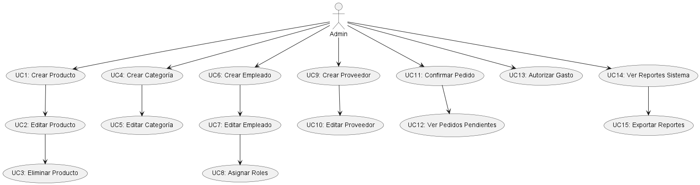

### Contabilidad
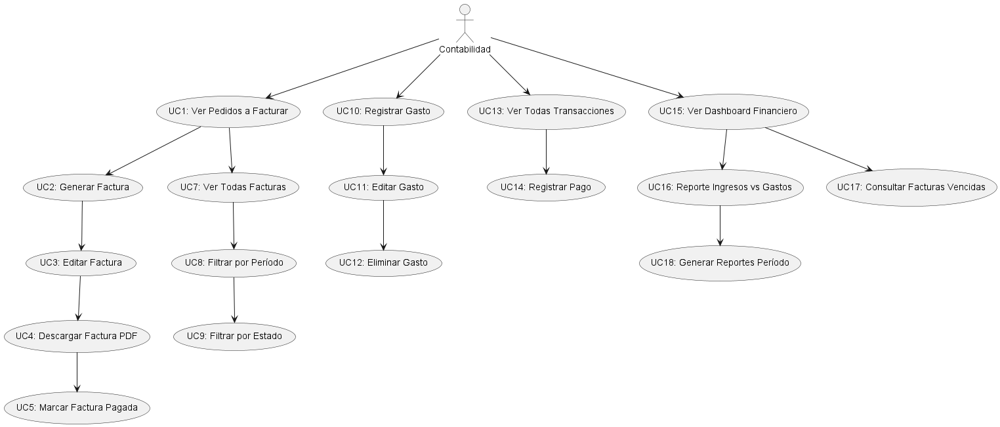

### Logística
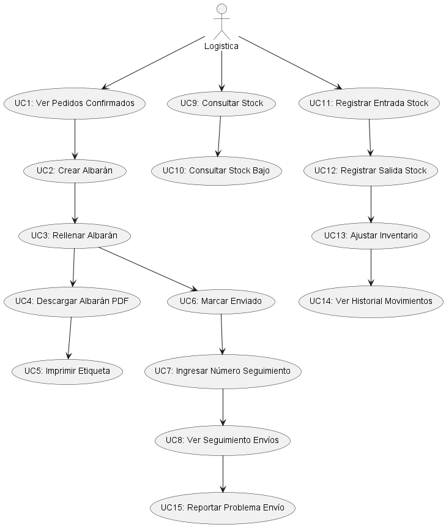

### Cliente
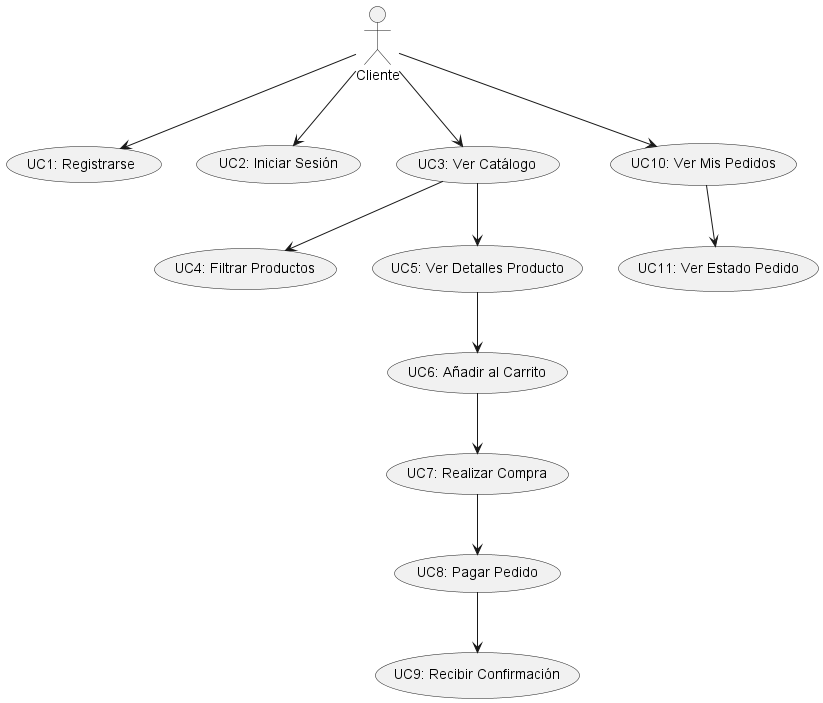

## 3- Diagrama de Base de Datos

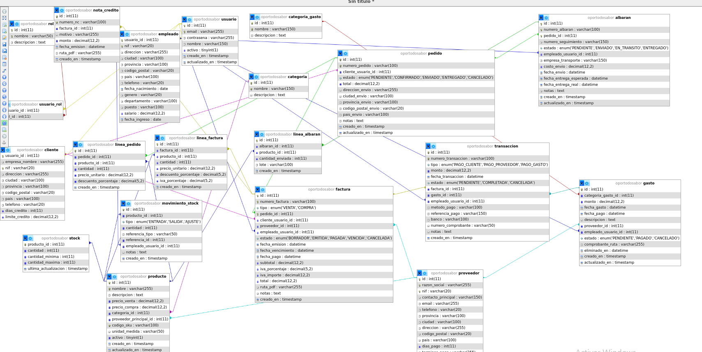

## 4- Deseño de interface de usuarios

### Pantalla registro
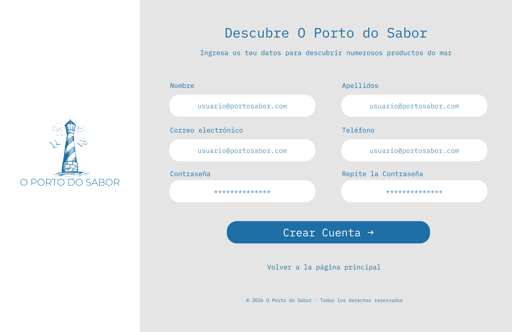

 

### Pantalla Login
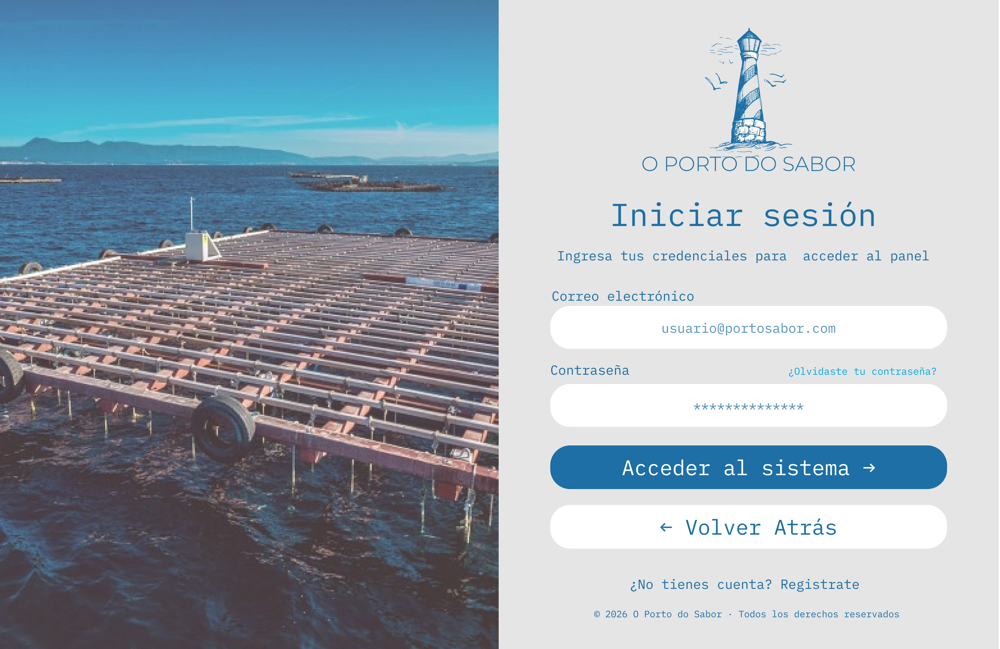

 

### Pantalla Admin
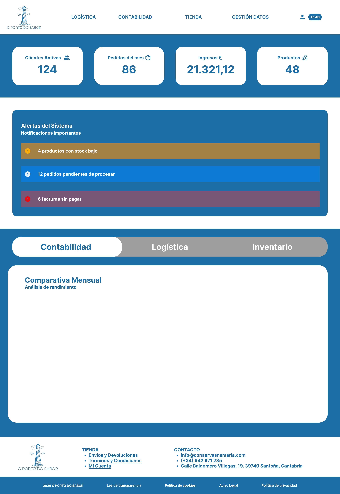

 

### Pantalla Contabilidad
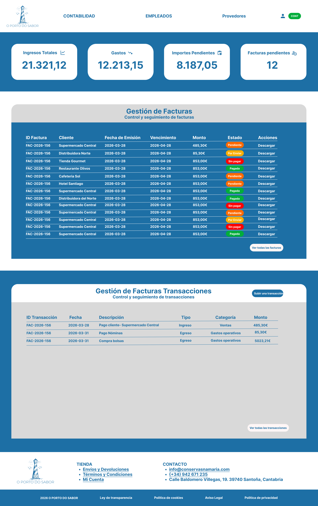

 

### Pantalla Logística
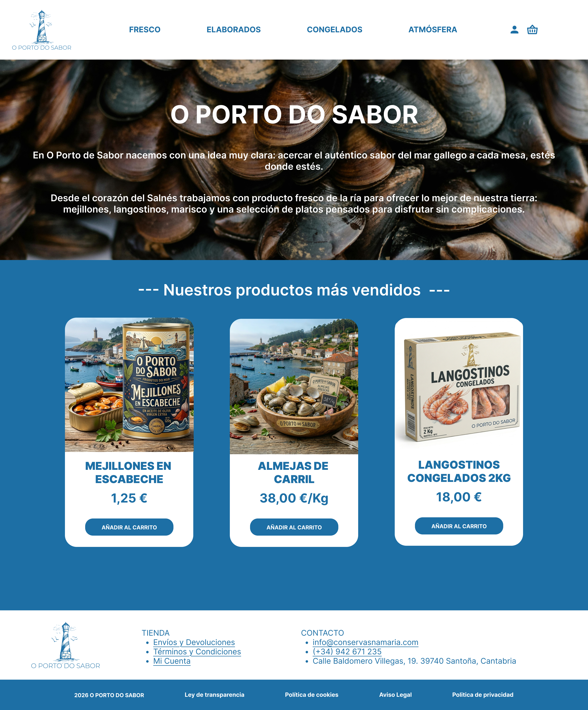

 

#### Flujo de navegación por roles en la aplicación web

#### Pantalla inicial: Login
Todos los usuarios deben iniciar sesión antes de acceder a cualquier funcionalidad.

#### Clientes
- Tras el login, los clientes acceden directamente a la **tienda**.
- Funcionalidades:
  - Crear pedidos
  - Ver productos
  - Ver pedidos anteriores
  

#### Administrador
- Tras el login, el administrador accede a su **dashboard**.
- Opciones dentro del dashboard:
  - **Contabilidad** - lleva a la pantalla de contabilidad
  - **Logística** - lleva a la pantalla de gestión de pedidos y productos
  -  **Datos Maestros** - Gestiona los datos de la app
  -  **Acceso Tienda** - Accede a la tienda

#### Contabilidad
- Tras el login, contabilidad accede a su **dashboard**.
  - Consultar datos económicos
  - Revisar facturas
  - Revisa Transacciones
  - Revisa Pedidos 
  - Revisa Empleados

#### Logística
-  Tras el login, logística accede a su **dashboard**.
- Funcionalidades:
  - Cambiar estado de pedidos
  - Gestión de stock

[**<-Anterior**](../../README.md)
